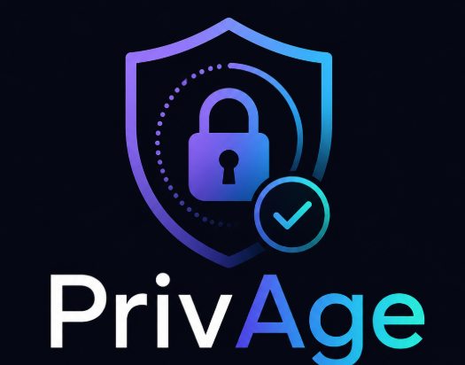
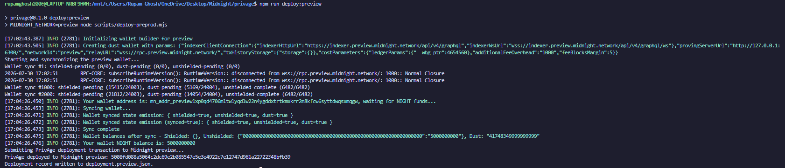
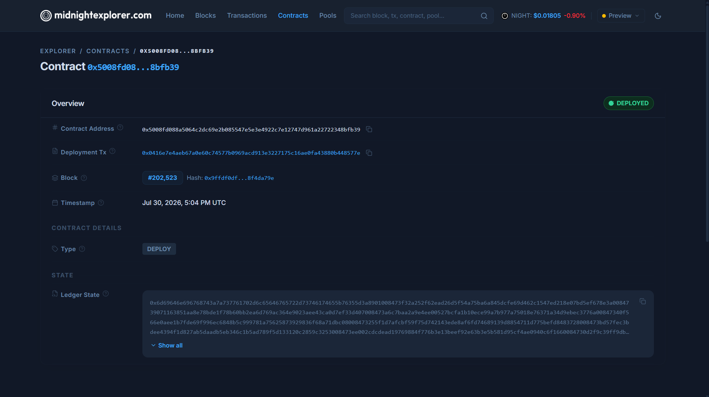

# PrivAge

<p align="center">
  
</p>

<p align="center">
  <a href="https://github.com/rupamghosh2006/privage/actions/workflows/ci.yml"></a>
</p>

> A Midnight Age / Eligibility Gate that proves a person meets an access policy without revealing their age or date of birth.

## Submission Checklist

| Requirement | Status | Evidence / next action |
| --- | --- | --- |
| Public GitHub repository with complete README | Done | [rupamghosh2006/privage](https://github.com/rupamghosh2006/privage) |
| Live demo link | Pending | Deploy the Vite frontend and replace the placeholder in [Live Demo](#live-demo). |
| Midnight privacy model | Done | Compact contract, private-witness demo flow, and [Privacy Model](#privacy-model). |
| 3+ passing tests | Done | 12 Vitest tests currently pass. See [Testing](#testing). |
| CI/CD workflow with passing run | Done | [CI workflow](.github/workflows/ci.yml) compiles, tests, and builds on every push and pull request. |
| Test-output screenshot | Pending | Run `npm test`, capture the terminal output, and add it under `screenshots/`. |
| CI badge / workflow evidence | Done | CI badge above and [workflow file](.github/workflows/ci.yml). |
| One-minute demo video | Pending | Record the [demo script](#one-minute-demo-script) and add the link below. |
| Privacy-model explanation | Done | [Privacy Model](#privacy-model) states what observers can and cannot learn. |
| Product proposal submitted for approval | Pending external step | [PROPOSAL.md](PROPOSAL.md) is complete; submit it to the programme for approval. |
| 10+ meaningful commits | Done | More than 10 meaningful commits on the current project branch. |

## Live Demo

**Deployment URL:** _Pending deployment._

Deploy this Vite application to Vercel, Netlify, or a similar static host. Configure:

```bash
VITE_MIDNIGHT_CONTRACT_ADDRESS=5008fd088a5064c2dc69e2b085547e5e3e4922c7e12747d961a22722348bfb39
```

Then replace the placeholder above with the resulting public URL before submission.

## Project at a Glance

PrivAge is an **Age / Eligibility Gate** built for Midnight selective disclosure.

- A Compact contract accepts an opaque credential commitment from a trusted issuer.
- The contract's `proveEligibility` circuit checks a private age witness against `18+`, `21+`, or `25+`.
- The circuit intentionally returns only an eligibility boolean. It never reveals or stores a public age or date of birth.
- The browser includes a wallet-bound local demo issuer so reviewers can exercise the full grant/deny experience without handling sensitive data.

## Preview Contract

| Network | Contract address |
| --- | --- |
| Midnight Preview | `5008fd088a5064c2dc69e2b085547e5e3e4922c7e12747d961a22722348bfb39` |

## Demo Flow

1. Connect a Midnight-compatible wallet configured for **Preview**.
2. Choose **Issue demo credential**. This loads a synthetic issuer credential bound to that connected wallet for the current browser session.
3. Select an access policy: `18+`, `21+`, or `25+`.
4. Choose **Generate eligibility proof**.
5. The UI displays only **Verified eligible** or **Access denied**. It never renders the private witness, age, or date of birth.
6. Choose **Clear demo credential** to reset the session.

The demo issuer is visibly labelled **Demo issuer / local witness**. It models the Compact circuit's private-witness predicate and produces only the boolean result, but it does not submit a Preview transaction or pretend to be a production wallet proof.

### Production Issuer Path

A production issuer service must keep the issuer secret outside the browser, verify the user's source credential, submit `issueCredential` with an opaque commitment, and securely deliver the related encrypted witness to the recipient's wallet. The deployed Preview contract is ready for that integration; the local demo flow exists only to make the privacy behaviour easy to review.

## Privacy Model

| Category | What it contains | Who can learn it |
| --- | --- | --- |
| Public | Preview contract address, issuer identity, opaque credential commitments, one-way nullifiers, selected policy, and successful-proof counter | Anyone observing the chain |
| Private | Actual age, date of birth, credential salt, proof secret, and issuer secret | The credential holder and trusted issuer only |
| Proved without revealing | Whether the private credential satisfies the selected policy | The relying application receives only `true` or `false` |

An observer can see that the PrivAge contract exists and can inspect its public ledger entries. They cannot recover an age or date of birth from the opaque commitment or nullifier. PrivAge does not put an age field in the public ledger, return an age from the circuit, render it in the UI, or log it in the demo flow.

The Compact circuit's public return type is `Boolean`. The browser presents that result as **Verified eligible** or **Access denied**.

## Contract Design

The Compact contract is in [contracts/privage.compact](contracts/privage.compact).

- `issueCredential` verifies the issuer's private secret and records a salted opaque credential commitment.
- `proveEligibility` accepts a private witness, validates its commitment, checks the supported threshold, and discloses only the eligibility boolean.
- Eligible proofs create a one-way nullifier, preventing replay without revealing the credential.

## Testing

Run the suite locally:

```bash
npm test
```

Current coverage includes 12 passing tests for:

- eligible and ineligible private-witness cases;
- threshold boundaries;
- the guarantee that private values never occur in public output;
- the absence of public age/date fields in the Compact ledger and browser UI;
- demo credential issuance, wallet binding, access grant, access denial, and proof-gateway integration.

Before submitting, capture the passing terminal output and save it as `screenshots/tests_passing.png`, then change the related checklist item to **Done**.

## CI/CD

The [GitHub Actions workflow](.github/workflows/ci.yml) runs on every push and pull request to `main` or `master`:

1. installs Node.js 22 and locked dependencies;
2. installs Midnight Compact;
3. compiles `contracts/privage.compact`;
4. runs `npm test`; and
5. runs the production Vite build.

The badge at the top of this README links directly to the workflow runs.

## Deployment Evidence

The following screenshots record the successful Preview deployment and independent Explorer verification.





## One-Minute Demo Script

Use this sequence when recording the submission video:

1. Open the hosted PrivAge application and point out the **Preview** network status.
2. Connect the Midnight wallet.
3. Point out the public/private/proved disclosure panel.
4. Issue the local demo credential; note that no age field is requested or displayed.
5. Select `18+`, generate the proof, and show **Verified eligible**.
6. Select `21+` or `25+`, generate the proof, and show **Access denied**.
7. Close by showing the Preview contract address, CI badge, and privacy-model section in this README.

**Video URL:** _Pending recording._

## Product Proposal

The complete product proposal is in [PROPOSAL.md](PROPOSAL.md). Submit this document through the programme's approval process and update the checklist once approval is received.

## Local Setup

Prerequisites:

- Node.js 22.12 or newer
- npm 10 or newer
- Midnight Compact for contract compilation
- A Midnight-compatible browser wallet configured for Preview

```bash
npm ci
copy .env.example .env
npm run dev
```

The Preview contract address is already included in `.env.example`. To compile the Compact contract from Linux/macOS or WSL:

```bash
npm run compile
```

## Technology

- Midnight Compact for the private eligibility contract
- Midnight Preview for the deployed contract
- React 19, TypeScript, and Vite for the dApp interface
- Midnight DApp Connector API for wallet compatibility
- Vitest for privacy and eligibility tests
- GitHub Actions for continuous integration
